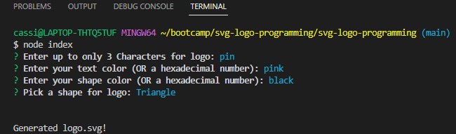

## Object-oriented Programming Challenge: SVG Logo Maker

## User Story

AS a freelance web developer

I WANT to generate a simple logo for my projects

SO THAT I don't have to pay a graphic designer

## Acceptance Criteria

GIVEN a command-line application that accepts user input

WHEN I am prompted for text

THEN I can enter up to three characters

WHEN I am prompted for the text color

THEN I can enter a color keyword (OR a hexadecimal number)

WHEN I am prompted for a shape

THEN I am presented with a list of shapes to choose from: circle, triangle, and square

WHEN I am prompted for the shape's color

THEN I can enter a color keyword (OR a hexadecimal number)

WHEN I have entered input for all the prompts

THEN an SVG file is created named `logo.svg`

AND the output text "Generated logo.svg" is printed in the command line

WHEN I open the `logo.svg` file in a browser

THEN I am shown a 300x200 pixel image that matches the criteria I entered

## Mock-Up

## Installation Process

Node.js

Jest

Inquirer.js

## Resources

Helpful SVG Resources-

 https://developer.mozilla.org/en-US/docs/Web/SVG/Tutorial

 https://developer.mozilla.org/en-US/docs/Web/SVG/Tutorial/Basic_Shapes 

 https://developer.mozilla.org/en-US/docs/Web/SVG/Tutorial/Texts

 https://marketplace.visualstudio.com/items?itemName=jock.svg

 Youtube-
 
Introduction To Testing In JavaScript With Jest: https://www.youtube.com/watch?v=FgnxcUQ5vho

SVG Logo Maker: https://www.youtube.com/watch?v=GJYMcLus3v0&t=172s

## Results

Screencastify video: https://drive.google.com/file/d/1jcUoaxDcdIWBCr7ASWpJFSWkvWGDIiP1/view

Github: https://github.com/Cferguson18/svg-logo-programming.git

